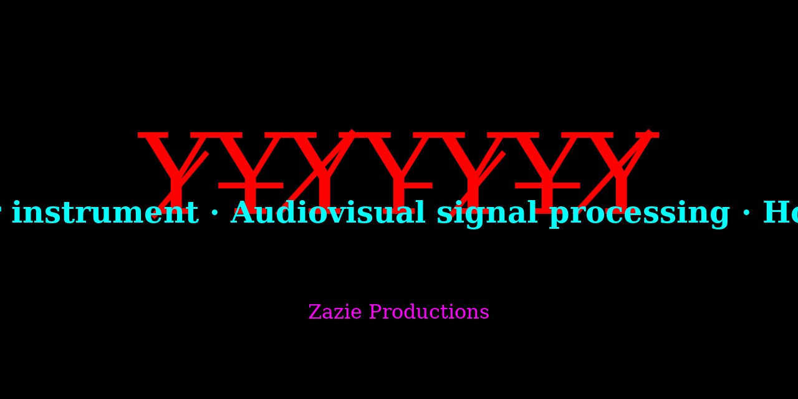
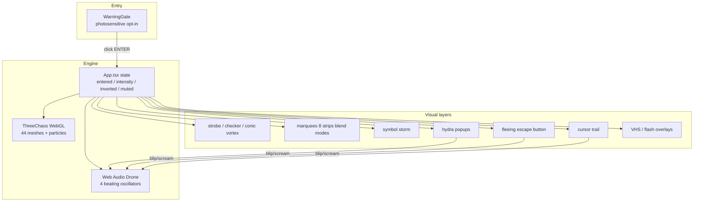

<div align="center">

# Y̷Y̶Y̸Y̵Y̷Y̶Y̸

### _the machine god is awake_

**A browser-based audiovisual instrument exploring procedural systems, signal processing, and hostile interface design.**

[](https://zazie-productions.github.io/Conic-Vortex/)
[](https://github.com/zazieproductions/Conic-Vortex/actions)
[](https://threejs.org/)
[](https://react.dev/)
[](https://www.typescriptlang.org/)
[](LICENSE)

<p align="center">
  
</p>

</div>

> ⚠️ **CONTENT WARNING** — This experience contains rapidly flashing lights,
> strobing colors, loud procedural noise, and aggressive motion. **Not suitable
> for photosensitive visitors, the faint of heart, or the sane.** A warning gate
> is presented on load; entry is an explicit opt-in.

---

## Why this exists

Y̷Y̶Y̸Y̵Y̷Y̶Y̸ is a creative-technology piece that sits at the intersection of
generative graphics, procedural audio, and adversarial interface design. It is
simultaneously:

- a **real-time WebGL instrument** (three.js orbital cloud of 44+ procedurally
  placed meshes, 900 particles, 21 occult sprites),
- a **procedural audio engine** (Web Audio API beating drone, stochastic
  glitches, stochastically-timed audio bursts),
- a **hostile-UI experiment** (self-replicating popups that multiply when you
  close them, an escape button that flees your cursor, a reality-invert toggle),
- a **typographic and motion-design composition** (conic-gradient vortex,
  scrolling blackletter/glitch marquees, VHS scanlines, a glitch-clip wordmark),
- a **small, dependency-light, fully-auditable** open-source codebase.

It deliberately rejects the polish conventions of consumer software. The
interface _obstructs_ the user; the audio beats and detunes; the camera rolls
and precesses; popups appear at random. The reward for clicking through the
warning is a system you can steer (intensity 1–5, mute, invert) but never
fully control.

## What it does

At runtime the experience composes ten z-ordered layers — from a strobing
conic-gradient background through a WebGL vortex, runic symbol storm,
scrolling marquees, hydra popups, a fleeing escape button, a mouse trail of
glyphs, VHS scanlines and stroboscopic flashes, to a bottom-centre control
altar. Every click generates a procedural audio blip; every popup spawn
and every intensity ramp triggers a burst of glitches.

### Key capabilities

- **Procedural 3D vortex** — 44 meshes (tori, knots, Platonic solids,
  primitives) orbiting a giant wireframe torus knot, with HSL-cycling
  materials, 21 billboarded sigil sprites, and a 900-point coloured
  particle field.
- **Live Web Audio synthesis** — four detuned beating oscillators with LFO
  pitch modulation form the drone; one-shot random-waveform glitches and
  5-burp "screams" are triggered by interaction. **No external audio
  files.**
- **Hydra-rule popups** — fake system popups that multiply when closed
  (close one, two appear), capped at 7.
- **Symbol storm** — 42–90 occult glyphs that teleport, spin, shake, blink
  and zoom, with density tied to the chaos-intensity dial.
- **Hostile UI primitives** — fleeing escape button that escalates its
  taunts; invert-reality toggle that hue-rotates everything; cursor trail
  of fading glyphs.
- **Warning gate** — explicit photosensitive-epilepsy opt-in before any
  strobes or audio begin.

## Architecture at a glance



For deep dives:

- [Architecture overview](docs/architecture/overview.md)
- [Three.js vortex](docs/architecture/three-chaos.md)
- [Audio engine](docs/audio/engine.md)
- [Popup dynamics](docs/architecture/popup-hell.md)
- [Development workflow](docs/development/workflow.md)

## Quick start

```bash
git clone https://github.com/zazieproductions/Conic-Vortex.git
cd Conic-Vortex
npm install
npm run dev
# then open http://localhost:5173 and click ENTER THE VOID
```

### Requirements

- Node.js **≥ 20**
- A modern desktop browser (Chrome, Firefox, Safari, Edge). Mobile works
  but integrated GPUs may drop frames at high intensity.

### Production build

```bash
npm run build    # runs tsc -b then vite build → dist/
npm run preview  # serve dist/ locally
```

### Validation (typecheck + lint + format + build)

```bash
npm run validate
```

## Usage — the Control Altar

Once inside, three buttons at the bottom centre let you steer the chaos:

| Control                   | Effect                                                                                                   |
| ------------------------- | -------------------------------------------------------------------------------------------------------- |
| ☠ **DO NOT CLICK**        | Toggles `invert-world` (colour inversion + hue-rotate). Plays `scream()`.                                |
| ⛧ **MORE CHAOS [n/5]**    | Increments intensity 1→5 (wraps). Symbol count scales 42→90; popup spawn rate doubles. Plays `scream()`. |
| 🔊 **NOISE ON / SILENCE** | Smoothly fades the drone and all blips to silence (or back).                                             |

Moving your mouse paints a trail of fading glyphs. Clicking the background
fires a blip. Trying to close a popup summons two more. Trying to click
**CLICK TO ESCAPE** makes it flee and escalates its taunt (TOO SLOW →
PATHETIC → THERE IS NO ESCAPE → YOU LIVE HERE NOW).

## Configuration

The project intentionally has **no runtime configuration files or
environment variables that change the artwork** — the piece is the code.
Build-time configuration is limited to:

| Variable                       | Default | Purpose                                                                                                                                                    |
| ------------------------------ | ------- | ---------------------------------------------------------------------------------------------------------------------------------------------------------- |
| `VITE_BASE`                    | `./`    | Vite `base` path. Set to `/Conic-Vortex/` when deploying to a GitHub Pages project page; `./` works for any subpath including local preview and `file://`. |
| Any `VITE_*` / `NEXT_PUBLIC_*` | —       | Exposed to client code as `process.env.*` (see `vite.config.ts`). Not currently used by the artwork, but available for experiments.                        |

## Project structure

```
Conic-Vortex/
├── public/                 # Static assets (favicon, sprite PNGs) served at root
│   ├── favicon.svg
│   └── sprites/
├── src/
│   ├── App.tsx             # Composition root, state, control altar
│   ├── main.tsx            # React entry
│   ├── index.css           # Tailwind @theme + every keyframe animation
│   ├── audio/engine.ts     # Web Audio: drone, blip, scream, mute
│   ├── components/         # One file per visual subsystem
│   │   ├── ThreeChaos.tsx
│   │   ├── MarqueeLayer.tsx
│   │   ├── SymbolStorm.tsx
│   │   ├── PopupHell.tsx
│   │   ├── CursorTrail.tsx
│   │   ├── EscapeButton.tsx
│   │   └── WarningGate.tsx
│   ├── data/               # Content palettes separated from rendering
│   │   ├── marquees.ts
│   │   ├── popups.ts
│   │   └── symbols.ts
│   └── utils/id.ts
├── scripts/                # Node utilities (asset generation, screenshots)
├── docs/                   # Architecture, audio, development docs
├── .github/workflows/      # CI + Pages deploy
├── index.html
├── vite.config.ts
├── tsconfig*.json
├── eslint.config.js
└── .prettierrc.json
```

## Development

```bash
npm run dev          # Vite + HMR
npm run typecheck    # tsc -b
npm run lint         # ESLint
npm run lint:fix
npm run format       # Prettier
npm run validate     # All of the above + production build
npm run assets:generate   # Regenerate the sigil PNGs (dependency-free Node script)
npm run screenshots # Puppeteer capture (needs a running dev server on :5173)
```

See [docs/development/workflow.md](docs/development/workflow.md) for a
deeper orientation, including coding conventions and deployment.

## Testing

Automated testing is deliberately lightweight — there are no unit tests
for the visual composition (it's art; snapshots would ossify it and
undermine iteration). Validation is:

1. **TypeScript strict mode** catches API mistakes and dead code.
2. **ESLint** (with React Hooks and react-refresh plugins) catches common
   React footguns.
3. **Prettier** enforces consistent formatting.
4. **Production build** (`npm run build`) must succeed; Vite will surface
   import-resolution errors.
5. **Manual QA checklist** (in the contributor guide): warning gate,
   entry audio, all three control-altar buttons, popup hydra behaviour,
   fleeing escape button, cursor trail, mute persistence across
   intensity changes, invert toggle, resize behaviour.

If you add a substantive subsystem, please add a document under
`docs/` describing how it works.

## Accessibility & safety

- **Warning gate.** The first screen is a black page with a
  high-contrast photosensitive-epilepsy warning. No strobing, no audio,
  no motion occurs until the user explicitly clicks **ENTER THE VOID**.
- **Mute.** Audio can be disabled from the control altar immediately
  after entry, and `toggleMute()` fades the drone gain rather than
  clicking, so no new listener gets an unexpected blast.
- **Reduced motion.** The project deliberately violates WCAG motion
  guidance as an artistic choice; the warning gate is the opt-out
  mechanism. A future iteration may honour `prefers-reduced-motion` by
  entering at intensity 1 and disabling strobe layers.
- **No external network calls** at runtime. No analytics, no CDN
  fonts? — fonts come from Google Fonts at time of writing; see
  [Roadmap](#roadmap) for the planned self-hosting move.
- **All ARIA** is labelled on the interactive controls and the warning
  gate (`role="alertdialog"`), but visual decorations are `aria-hidden`.

## Performance

- 44 meshes + 900 particles + 21 sprites rendered by WebGL; materials
  are intentionally unlit (`MeshBasicMaterial`, `MeshNormalMaterial`) to
  skip lighting calculations.
- `pixelRatio` is capped at 1.5 to protect 4K displays from fill-rate
  death; `antialias` is off (harsh edges are part of the aesthetic).
- CSS animations (marquees, strobes, glitches) run on the compositor
  thread — JS is not on the hot path.
- React state updates tick at ≤3 Hz (popups, symbols, visitor counter);
  trail bits are throttled to one per 40 ms and capped at 24.
- Drone voices use `setTargetAtTime` for smooth fades; no audio files to
  stream.

## Troubleshooting

| Symptom                                      | Likely cause                                                            | Fix                                                                                     |
| -------------------------------------------- | ----------------------------------------------------------------------- | --------------------------------------------------------------------------------------- |
| No sound on load                             | Browsers suspend AudioContext until a user gesture.                     | Click **ENTER THE VOID** (or any button) — `initAudio()` is called on enter.            |
| Frame drops on laptop                        | 44 meshes + 900 particles + CSS animations saturate an iGPU.            | Drop intensity to 1; close other WebGL tabs; use a discrete GPU.                        |
| Popups stop appearing                        | You hit `MAX_POPUPS = 7`.                                               | By design: closing one still replaces it with two up to the cap.                        |
| 404s on `/sprites/*.png` after a fresh clone | The generated PNGs are committed; if they're missing run the generator. | `npm run assets:generate`                                                               |
| `base` mismatch on Pages                     | Vite `base` defaults to `./` for portability.                           | Set `VITE_BASE=/Conic-Vortex/` as a GitHub Actions env var / Pages config.              |
| HMR double-plays scream in dev               | React 19 StrictMode double-invokes effects in dev.                      | The audio engine guards against double init; duplicate screams are a dev-only artefact. |

## Roadmap

A full, aspirational roadmap lives in [ROADMAP.md](ROADMAP.md). Headline
items include:

- Shader-based post-processing (bloom, chromatic aberration)
- WebMIDI / OSC input for live-performance mapping
- Convolver reverb and PannerNode for spatial audio
- Microphone-input reactivity
- Self-hosted Google Fonts (kill the external stylesheet)
- `prefers-reduced-motion` safety mode
- FFT-driven mesh parameter modulation (audio-visual sync)

## Contributing

Contributions are welcome. **The bar is "does this preserve or amplify
the project's weirdness while making it more robust?"** — please don't
submit PRs that pastel-wash the aesthetic, remove the warning gate, or
turn this into a generic SaaS landing page.

See [CONTRIBUTING.md](CONTRIBUTING.md) for the full workflow. TL;DR:

1. Fork and branch off `main` (or the active `arena/*` branch during
   sprints).
2. `npm install && npm run validate` must pass.
3. Update docs under `docs/` if you add or change a subsystem.
4. Open a PR describing what changed, why, and how it serves the
   artistic intent.

## License

Released under the [MIT License](LICENSE). Built and maintained by
**[Zazie Productions](https://github.com/zazieproductions)**.

### Credits

- **Code & concept** — Zazie Productions
- **Fonts** — UnifrakturMaguntia, Rubik Glitch, Nosifer, Eater, Metal
  Mania, Creepster (Google Web Fonts)
- **Sigil sprites** — Generated by `scripts/generate-assets.mjs` (no
  external imagery, public-domain procedural glyphs)
- **Audio** — Synthesised live via Web Audio API

---

<p align="center">
  <sub>he who scrolls shall be scrolled</sub>
</p>
