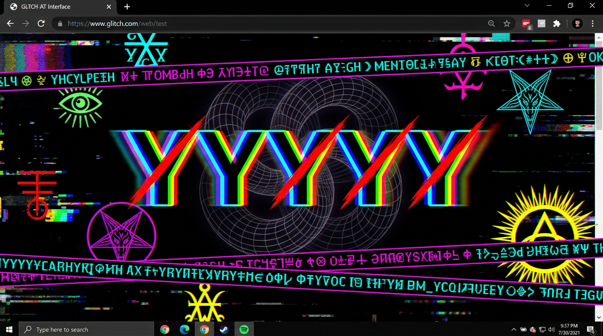
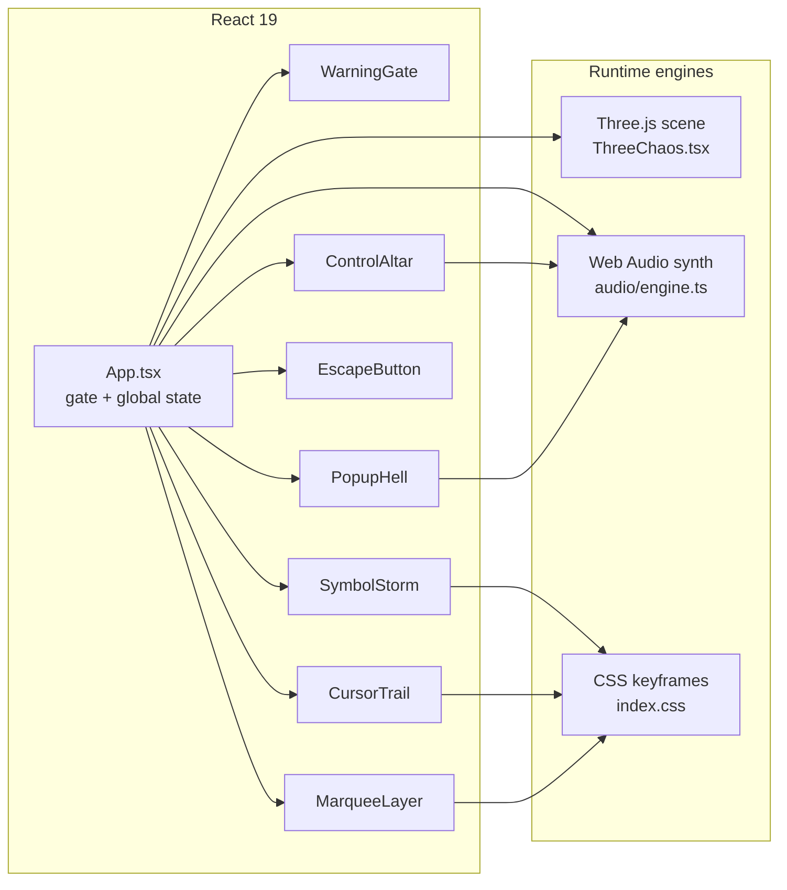

<div align="center">

# ⟁ Conic-Vortex

### Y̷Y̶Y̸Y̵Y̷Y̶Y̸ — a real-time browser instrument for procedural audio-visual chaos

A hostile-interface glitch experience: procedural 3-D geometry, Web-Audio synthesis,
rune storms, self-replicating popups, and an uncooperative UI. Built with **React 19 ·
Vite 7 · Three.js · Tailwind CSS 4**.

**Zazie Productions**

[](https://zazie-productions.github.io/Conic-Vortex/)
[](https://github.com/zazieproductions/Conic-Vortex/actions)
[](LICENSE)

</div>

> **⚠️ SENSORY WARNING —** the live piece contains **rapidly flashing lights,
> strobing colors, loud procedural noise, and aggressive motion**. It is not
> suitable for photosensitive visitors. A mandatory acknowledgement gate is shown
> before anything runs — you can always leave at the gate.

<div align="center">



_Preview render of the running experience. Capture pixel-true screenshots anytime with [`npm run capture:screenshots`](#screenshots)._

</div>

---

## Table of contents

1. [Why it exists](#why-it-exists)
2. [What it does](#what-it-does)
3. [Key capabilities](#key-capabilities)
4. [Demo / preview](#demo--preview)
5. [Architecture](#architecture)
6. [Project structure](#project-structure)
7. [Quick start](#quick-start)
8. [Installation](#installation)
9. [Usage](#usage)
10. [Configuration](#configuration)
11. [Development](#development)
12. [Testing](#testing)
13. [Troubleshooting](#troubleshooting)
14. [Roadmap](#roadmap)
15. [Contributing](#contributing)
16. [License & credits](#license--credits)

---

## Why it exists

Conic-Vortex started as an experiment in **hostile information architecture**: an
interface designed to _resist_ its user rather than serve them. Instead of a calm
tool, it is a small, self-contained "machine god" that turns your cursor, your
clicks, and your willingness to look into part of a generative system.

It exists for three audiences:

- **Creative-technology portfolios / studios** — a compact, dependency-light
  demonstration of WebGL, Web Audio, and expressive CSS engineering as _art_.
- **Engineers & researchers** — clean React/TypeScript boundaries, a zero-asset
  audio engine, and a layered, mostly stateless render pipeline that is easy to
  read, fork, and repurpose.
- **Artists & audiences** — a one-click ritual object that requires no login,
  no install, and no explanation.

The repository is deliberately structured so the engineering quality is legible
_and_ the strangeness is preserved: this is a horror-object that is also a tidy
codebase.

## What it does

You land on a black screen. A warning tells you exactly what you are about to
experience. If you enter, you are dropped into a full-screen, real-time collage
of layered systems:

| Layer | System                       | What you see                                                                                               |
| ----: | :--------------------------- | :--------------------------------------------------------------------------------------------------------- |
|     0 | Strobe + checker backgrounds | High-speed color strobing over a scrolling conic-gradient vortex                                           |
|     1 | **Three.js scene**           | 44 procedurally seeded meshes orbiting a large wireframe knot, 900 particles, ~21 occult sprite billboards |
|     2 | Symbol storm                 | Runic glyphs that teleport, spin, and scale with the chaos level                                           |
|   2.5 | Giant sigils                 | Oversized eye / goat / sun glyphs rotating with `mix-blend-mode: difference`                               |
|     3 | Marquee strips               | 8 scrolling ticker bands of occult + technical prose                                                       |
|     4 | Popup hell                   | Self-replicating popups — close one and it "hydra"-spawns two                                              |
|     5 | Overlays                     | Flash bursts and VHS scanlines over everything                                                             |
|     6 | Cursor trail                 | Your cursor leaves a fading trail of rotating symbols                                                      |
|     7 | Control altar                | Three controls: **☠ DO NOT CLICK**, **⛧ MORE CHAOS**, **🔊 NOISE ON**                                      |

Everything is generated live in the browser. There are **no image assets in the
render path, no audio files, and no external data** — the eye/goat/sun glyphs are
the only shipped images, and the entire soundscape is synthesized by the Web Audio
API in `src/audio/engine.ts`.

## Key capabilities

- **Procedural 3-D scene** — `src/components/ThreeChaos.tsx` owns a self-contained
  Three.js world with per-mesh orbit/bob/spin kinematics and its own animation
  clock. React never re-renders it.
- **Synthesized audio engine** — `src/audio/engine.ts` builds a detuned, LFO-modulated
  drone plus `blip()` / `scream()` one-shots. Mute uses exponential gain ramps so
  the drone fades smoothly rather than snapping.
- **Intensity state** — a 1–5 chaos dial scales two independent systems:
  `SymbolStorm` count (`30 + intensity×12`) and `PopupHell` spawn cadence.
- **"Hydra" popups** — closing one popup summons two more, capped at `MAX_POPUPS`.
- **Photosensitive safety gate** — an explicit acknowledgement wall that also
  supplies the single user-gesture the browser requires before audio can start.
- **Accessible-by-a11y-docs controls** — the control altar carries live
  `aria-pressed`, `aria-label`, and descriptive text in addition to its on-theme copy.
- **WebGL-graceful degradation** — the 3-D layer disposes cleanly and, if WebGL is
  unavailable, logs and lets the rest of the piece run.

## Demo / preview

- **Live project:** <https://zazie-productions.github.io/Conic-Vortex/>
- **Local preview:** run [`npm run dev`](#development) and open the printed URL.

> This is an interactive, audio-visual work — a static screenshot cannot convey the
> motion or sound. If you are evaluating it as a portfolio piece, launch it with
> sound on and give it a few seconds to escalate.

## Architecture

The piece is a single-page app orchestrated by `src/App.tsx`. State lives in one
place and flows _down_ as props; the audio engine and the 3-D scene are side-effect
modules that never read React state. Rendering uses three complementary engines,
each chosen for what it does best:



The CSS keyframe layer is the workhorse for motion: strobe, marquee, hue-spin,
glitch, and scanline effects all run on the GPU/compositor rather than in
JavaScript, which is why the piece stays fluid despite being visually chaotic.

A detailed **system architecture** (component inventory, state, event flow, render &
audio pipelines, performance model, design decisions) lives in
[`docs/architecture.md`](docs/architecture.md).

## Project structure

```text
.
├── .github/
│   ├── ISSUE_TEMPLATE/          # Bug report & feature request templates
│   └── workflows/
│       ├── ci.yml               # lint · typecheck · format · build on PR/push
│       └── deploy-pages.yml     # build + publish to GitHub Pages on main
├── docs/                        # Authoritative, living documentation
│   ├── README.md                # docs index / map
│   ├── architecture.md          # system architecture & design decisions
│   ├── audio-engine.md          # the Web-Audio synthesis system
│   ├── rendering.md             # 3-D scene, CSS layer system, blend modes
│   ├── creative-methodology.md  # artistic intent & the hostile-interface canon
│   ├── configuration.md         # env vars, base path, build knobs
│   ├── development.md           # setup, workflows, debugging
│   ├── deployment.md            # GitHub Pages & asset-base notes
│   ├── testing.md               # verification & troubleshooting
│   └── images/                  # preview + social assets
├── public/                      # served as-is (favicon, og.png)
│   ├── favicon.svg
│   └── og.png
├── scripts/
│   └── capture-screenshots.mjs  # optional headless screenshot tooling
├── src/
│   ├── App.tsx                  # orchestrator: gate, global state, layer stack
│   ├── main.tsx                 # React root
│   ├── index.css                # Tailwind base + @theme fonts + keyframes
│   ├── assets/sprites/          # occult eye / goat / sun SVG billboards
│   ├── audio/engine.ts          # Web Audio synthesis (drone, blip, scream)
│   └── components/              # one focused module per visible system
│       ├── WarningGate.tsx
│       ├── ControlAltar.tsx
│       ├── ThreeChaos.tsx
│       ├── SymbolStorm.tsx
│       ├── PopupHell.tsx
│       ├── MarqueeLayer.tsx
│       ├── CursorTrail.tsx
│       └── EscapeButton.tsx
├── index.html                   # HTML shell + social/metadata + runtime harness
├── package.json
├── vite.config.ts               # build + env + optional source-tagging plugin
├── tsconfig*.json
├── eslint.config.js             # flat-config ESLint
└── .prettierrc.json
```

See [`docs/README.md`](docs/README.md) for the full documentation index.

## Quick start

Requires **Node.js ≥ 20.19** (npm ≥ 10).

```bash
git clone https://github.com/zazieproductions/Conic-Vortex.git
cd Conic-Vortex

npm install      # install dependencies
npm run dev      # start the dev server → open the printed local URL
```

## Installation

```bash
# Dependencies (reproducible install from the lockfile)
npm ci

# Run the development server with hot reload
npm run dev

# Type-check + build the production bundle into dist/
npm run build

# Preview the production build locally
npm run preview
```

## Usage

The "usage" of this piece is deliberately open-ended — point your cursor, click,
and let the chaos escalate. The three controls in the lower-center **Control Altar**
are the whole interface:

| Control                      | Effect                                                             |
| :--------------------------- | :----------------------------------------------------------------- |
| **☠ DO NOT CLICK**           | Toggles full-screen color inversion (`invert-world`) with a scream |
| **⛧ MORE CHAOS [n/5]**       | Raises intensity 1→5 (wraps); more symbols, faster popups          |
| **🔊 NOISE ON / 🔇 SILENCE** | Mutes the drone + effects with a smooth fade                       |

You cannot actually leave with the **escape** button — it runs away from your
cursor and taunts you. That is the point.

## Configuration

Conic-Vortex runs from sensible defaults and needs **no environment variables** to
work. A small set of optional build knobs exist for deployment:

| Variable                 | Purpose                                                                              | Default       |
| :----------------------- | :----------------------------------------------------------------------------------- | :------------ |
| `VITE_BASE`              | Base path served under (e.g. `/Conic-Vortex/` for a GitHub-Pages _project_ site)     | `/`           |
| `VITE_DEV_ALLOWED_HOSTS` | Comma-separated hosts allowed into the dev server (for sandboxed/live-preview hosts) | _(all local)_ |

Copy `.env.example` to `.env` if you need to override any. `npm run dev` and
`npm run build` pick the values up automatically. See
[`docs/configuration.md`](docs/configuration.md) and
[`docs/deployment.md`](docs/deployment.md).

## Development

All commands are declared in `package.json`:

| Command                           | What it does                                               |
| :-------------------------------- | :--------------------------------------------------------- |
| `npm run dev`                     | Vite dev server with hot reload                            |
| `npm run build`                   | `tsc -b` type-check then production `vite build` → `dist/` |
| `npm run preview`                 | Serve the production build locally                         |
| `npm run typecheck`               | Run TypeScript across app + node projects                  |
| `npm run lint` / `lint:fix`       | ESLint (flat config)                                       |
| `npm run format` / `format:check` | Prettier write / check                                     |
| `npm run validate`                | `lint` + `typecheck` + `build` in one shot                 |
| `npm run clean`                   | Remove `dist/`                                             |
| `npm run capture:screenshots`     | Optional headless screenshots (see below)                  |

See [`docs/development.md`](docs/development.md) for the full developer guide,
including branch guidance and a debugging checklist.

## Testing

There is no unit-test suite today — the piece is DOM/WebGL/Web-Audio heavy and its
primary "test" is a manual visual pass. Automated verification is provided by:

- **TypeScript strict checking** (`npm run typecheck`)
- **ESLint** (`npm run lint`)
- **Prettier** formatting (`npm run format:check`)
- **Production build** (`npm run build`)

All four run automatically in CI ([`.github/workflows/ci.yml`](.github/workflows/ci.yml))
on Node 20 and 22 for every PR and push to `main`. See
[`docs/testing.md`](docs/testing.md) for the manual test checklist and how to add
automated tests later.

### Screenshots

Real, pixel-true screenshots are captured with a headless browser. `puppeteer` is
deliberately **not** a default dependency (it would download Chromium on every
install), so install it once when you need it:

```bash
npm install -D puppeteer     # one-time
npm run dev                  # terminal 1: keep the dev server running
npm run capture:screenshots  # terminal 2: writes docs/images/*.png
```

## Troubleshooting

**The 3-D layer is missing.** The scene requires WebGL; if it is unavailable the
layer logs a warning and the rest of the piece runs. Check for a blocked GPU /
WebGL-disabled browser setting.

**No sound.** Browsers block audio until a user gesture. Click **ENTER THE VOID** —
that button call is what creates/resumes the `AudioContext`. If you muted with
🔇, toggle back to 🔊.

**GitHub Pages looks unstyled / sprites 404.** The deployed page must know it is
served from a sub-path. The Pages workflow sets `VITE_BASE=/Conic-Vortex/` for you;
for manual deploys set the same variable (see [`docs/deployment.md`](docs/deployment.md)).

**Dev server rejects a preview/forwarded host.** Vite 7 validates the `Host`
header. Start it with `VITE_DEV_ALLOWED_HOSTS=.your.domain npm run dev`, or omit it
for plain `localhost` work.

More in [`docs/testing.md`](docs/testing.md) → _Troubleshooting_.

## Roadmap

Direction and ideas are tracked separately in [`docs/roadmap.md`](docs/roadmap.md).
It distinguishes **near-term engineering polish**, **experimental systems**, and
open **research directions** — so what is implemented, what is planned, and what is
aspirational stay clear.

## Contributing

Contributions — code, documentation, audio-visual experiments, or aesthetic ideas —
are welcome. Please read [`CONTRIBUTING.md`](CONTRIBUTING.md) first, especially the
notes on preserving the project's artistic integrity (do not "startup-ify" it).
The short version:

1. Fork & clone.
2. Create a branch off `main`.
3. Keep changes small and logically separable.
4. Ensure `npm run validate` passes.
5. Open a pull request against `main`.

## License & credits

- **License:** [MIT](LICENSE) — © 2026 **Zazie Productions**.
- **Concept, art direction & systems:** Zazie Productions.
- **Engine stack:** [React](https://react.dev), [Vite](https://vite.dev),
  [Three.js](https://threejs.org), [Tailwind CSS](https://tailwindcss.com).
- **Fonts:** UnifrakturMaguntia, Rubik Glitch, Nosifer, Eater, Metal Mania &
  Creepster — served by Google Fonts.
- **Audio:** synthesized live with the Web Audio API — no audio files ship.
