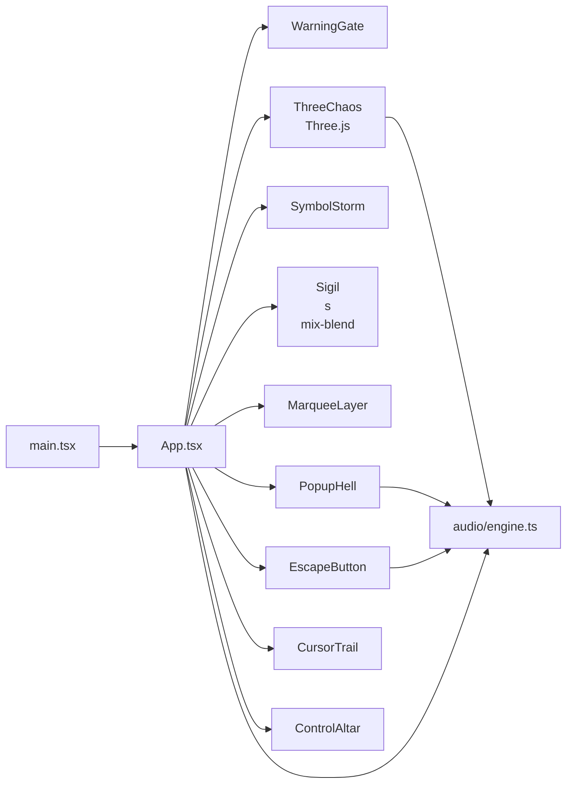
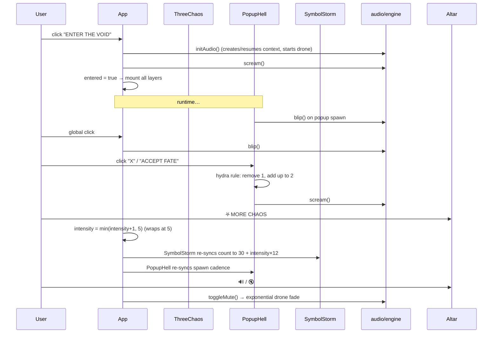

# System Architecture

Conic-Vortex is a single-page generative art application. This document describes
how it is put together and why. If you only read one section, read
[Major design decisions](#major-design-decisions).

## 1. Shape of the system

The whole experience is one React root rendered by `src/main.tsx`. `App.tsx`
orchestrates everything: it owns the small amount of global state, enforces the
entry gate, and composes a set of fixed, full-viewport layers. State flows _down_
through props; the two "engine" modules — the Three.js scene and the Web Audio
engine — are mounted as side effects and never read React state, so they never
cause re-renders.

### Application lifecycle

| Phase       | What is mounted    | Audio / 3-D                       |
| :---------- | :----------------- | :-------------------------------- |
| **Warning** | `WarningGate` only | Nothing runs                      |
| **Active**  | All layers         | Drone starts; scene animates      |
| **Exit**    | Unmount            | Intervals cleared; WebGL disposed |

The gate is not optional decoration: it is the ethical content boundary _and_ the
single user gesture the browser requires before an `AudioContext` may start.

## 2. Module inventory

| Path                              | Responsibility                                                                                                  |
| :-------------------------------- | :-------------------------------------------------------------------------------------------------------------- |
| `src/main.tsx`                    | React root (`createRoot` + `<StrictMode>`)                                                                      |
| `src/App.tsx`                     | Orchestrator: `entered`, `inverted`, `intensity`, `muted`, `counter`; composes layers; visitor-counter interval |
| `src/index.css`                   | Tailwind base, `@theme` font tokens, every keyframe animation, global rules                                     |
| `src/audio/engine.ts`             | Procedural Web-Audio engine (`initAudio`, `toggleMute`, `blip`, `scream`)                                       |
| `src/components/ThreeChaos.tsx`   | Self-contained Three.js scene (meshes, knot, sprite billboards, particles)                                      |
| `src/components/WarningGate.tsx`  | Photosensitive/EP warning + acknowledgement button                                                              |
| `src/components/ControlAltar.tsx` | Invert / intensity / mute controls                                                                              |
| `src/components/SymbolStorm.tsx`  | Rune storm whose density scales with `intensity`                                                                |
| `src/components/PopupHell.tsx`    | Self-replicating popups ("hydra" close rule)                                                                    |
| `src/components/MarqueeLayer.tsx` | 8 scrolling ticker strips with blend modes                                                                      |
| `src/components/CursorTrail.tsx`  | Cursor-following fading symbol bits                                                                             |
| `src/components/EscapeButton.tsx` | A button that flees the cursor and taunts you                                                                   |
| `src/assets/sprites/`             | The eye / goat / sun SVG billboards                                                                             |
| `.vite-source-tags.js`            | Optional dev/build plugin stamping `data-source-loc` for source-aware tooling (not used by the app)             |

### State owned by `App`

| State       | Type           | Meaning                                        |
| :---------- | :------------- | :--------------------------------------------- |
| `entered`   | `boolean`      | Gate state — nothing else mounts until true    |
| `inverted`  | `boolean`      | World-wide `invert-world` filter               |
| `intensity` | `number` (1–5) | Chaos dial; drives `SymbolStorm` + `PopupHell` |
| `muted`     | `boolean`      | Mirror of the audio engine mute flag           |
| `counter`   | `number`       | "Visitor #" ordinal ticking every 1.8 s        |

No context API or external store is used; the tree is shallow enough that prop
drilling is the clearest option.

## 3. Event flow

### Driver pattern per layer

| Layer                     | Driver                         | Frequency                            |
| :------------------------ | :----------------------------- | :----------------------------------- |
| Three.js scene            | `requestAnimationFrame`        | per frame                            |
| Cursor trail              | `mousemove` (throttled ~40 ms) | on pointer move                      |
| Symbol storm              | `setInterval`                  | every 350 ms                         |
| Popups                    | `setInterval`                  | `max(1200, 3200 − intensity×400)` ms |
| Visitor counter           | `setInterval`                  | every 1800 ms                        |
| Marquee / strobe / sigils | CSS keyframe animations        | compositor-driven                    |
| Drone LFO                 | Web Audio automation           | continuous                           |

## 4. Rendering architecture

Three complementary rendering engines, each chosen deliberately:

1. **Three.js WebGL** (`ThreeChaos`) — owns the 3-D world on a `<canvas>` and
   animates it with its own clock. All materials are unlit (`MeshBasicMaterial` /
   `MeshNormalMaterial`) because the aesthetic is pure shape + hue, with no
   lighting budget.
2. **CSS keyframe layer** (`index.css`) — strobe, marquee scroll, hue-spin,
   glitch, flash, and scanlines run on the compositor. This keeps the most
   visually expensive motion off the JavaScript main thread.
3. **React text / glyph layers** (`SymbolStorm`, `PopupHell`, `MarqueeLayer`) —
   DOM nodes positioned with `%` and animated via CSS. React re-renders only on
   `setInterval` ticks, not per frame.

**Z-order contract** (low → high, all fixed/full-screen): backgrounds → 3-D scene
`z-10` → symbol storm + sigils `z-20` → marquees + center title `z-30` → popups
`z-40` → escape button `z-50` → flash/scanline overlays `z-60/61` → cursor trail
`z-90` → control altar `z-[70]` … and the warning gate sits above everything at
`z-[100]`.

## 5. Audio architecture

All sound is synthesized with the Web Audio API — no audio assets ship. The drone
is four detuned oscillators (two sawtooth, two triangle; fundamentals ≈ 55–83 Hz),
each frequency-modulated by its own slow LFO for organic drift. Short one-shots
(`blip`, and `scream` = five rapid blips) are envelope-shaped oscillator glissandos.
Muting is an exponential `setTargetAtTime` ramp so the drone does not click.
See [`audio-engine.md`](audio-engine.md).

## 6. Data architecture

There are **no runtime data fetches and no server**. Every text string, color,
glyph, and animation parameter is either a local constant or produced
procedurally at runtime. Nothing is persisted — closing the tab resets the world
(which is intentional: the machine forgets you, then you forget it).

## 7. Performance model

- **GPU** is dominated by the Three.js scene: 44 meshes + 900 particles + up to
  21 sprite billboards, plus full-screen blend modes and conic gradients.
- **CPU** is light: a handful of `setInterval`s and the audio graph. All busy
  animation is offloaded to the compositor/GPU.
- **Mitigations already in place:** pixel ratio capped at `devicePixelRatio ≤ 1.5`,
  `antialias: false`, sprite/GUI budgets bounded, geometry disposed on unmount.
- **Watch-outs:** the strobe/`invert-world` filters and heavy blend modes are
  compositor-costly on integrated GPUs; mobile may struggle. See
  [`testing.md`](testing.md) for the manual perf pass.

## 8. External dependencies

Production: `react`, `react-dom`, `three`, `tailwindcss`. Build/tooling: `vite`,
`@vitejs/plugin-react`, `@tailwindcss/vite`, `typescript`, ESLint, Prettier, and
type packages. There are no unused runtime dependencies — see the note under
[Major design decisions](#major-design-decisions) about that history.

## 9. Major design decisions

1. **Gate first, always.** Prevents photosensitive harm and provides the required
   user gesture for audio. Non-negotiable.
2. **CSS keyframes for the flashy stuff.** Strobe/marquee/glitch off the main
   thread → fluid despite visual chaos.
3. **Side-effect engines stay un-rendered.** The 3-D scene and audio engine don't
   subscribe to React state; `App` only nudges them via props/intervals. This is
   what keeps 60 fps and a stable audio graph.
4. **Intensity as a single dial** that drives two independent subsystems. Simple
   to reason about, dramatic in effect.
5. **No persistence, no server, no assets-on-demand.** The whole piece fits in a
   static bundle; it is reproducible and portable.
6. **Hand-drawn SVG glyphs over raster.** The eye/goat/sun sigils are SVG modules
   imported through Vite so they are transparent, resolution-independent, and
   correctly `base`-hashed on sub-path deploys.
7. **Dependencies were pruned.** `framer-motion`, `lucide-react`, and
   `react-router-dom` were present in the template baseline but unused; they were
   removed rather than carried "just in case."

## 10. Trade-offs & known limitations

- No automated unit tests (see [`testing.md`](testing.md)); verification is
  type-check + lint + build + manual visual pass, run in CI.
- The scene targets desktop-class GPUs; no responsive breakpoints for phones.
- Fonts load from Google Fonts at runtime, so offline the system serif fallbacks
  render instead.
- `data-source-loc` source-tagging only exists when the optional
  `.vite-source-tags.js` plugin is present; the app never depends on it.
