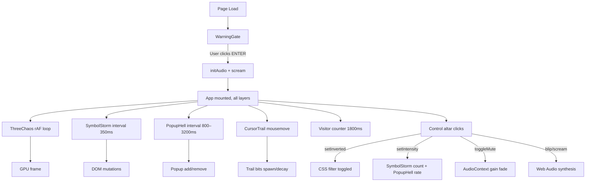

# Architecture Overview

Y̷Y̶Y̸Y̵Y̷Y̶Y̸ is a single-page interactive art application that composes four
distinct rendering and synthesis engines into one coherent, chaotic whole:

1. **Three.js WebGL** — a 3D orbital cloud of 44 procedurally placed meshes
   (Platonic solids, knots, tori, primitives), a central wireframe torus knot,
   21 billboarded occult sprites, and a 900-point particle field.
2. **CSS animations** — strobing backgrounds, conic-gradient spirals, scrolling
   marquees, rainbow text, glitch clips, VHS scanlines, flash bursts.
3. **DOM/React** — the popup hell subsystem, symbol storm, cursor trail,
   fleeing escape button, and the control altar.
4. **Web Audio API** — a four-voice beating drone plus stochastically generated
   glitches ("blips") and bursts ("screams").

There is no server, no networking at runtime, and no external audio or 3D
asset files beyond three generated sigil PNGs. Everything you see and hear is
synthesised in the browser.

## Layer Composition

The composition is a strictly z-ordered stack of fixed-position layers inside
a full-viewport `
`. From back to front:

| Z-Index | Layer                         | Description                                         |
| ------: | ----------------------------- | --------------------------------------------------- |
|       — | `WarningGate`                 | Epilepsy / content warning; must be clicked through |
|       0 | strobe + checker + spiral     | Background: colour-cycling strobing, conic vortex   |
|      10 | `ThreeChaos`                  | WebGL canvas for the 3D vortex                      |
|      20 | `SymbolStorm` + giant sigils  | Runic glyph field + rotating eye/goat/sun PNGs      |
|      30 | `MarqueeLayer` + centre title | Scrolling text strips + the Y̷Y̶Y̸Y̵Y̷Y̶Y̸ wordmark        |
|      40 | `PopupHell`                   | Fake self-replicating windows                       |
|      50 | `EscapeButton`                | Fleeing button                                      |
|   60–61 | flash overlay + VHS lines     | Post-processing-like flashes and scanlines          |
|      70 | `ControlAltar`                | Bottom-centre buttons (invert, chaos, mute)         |
|      90 | `CursorTrail`                 | Mouse-following symbol trail                        |

Each visual layer is `pointer-events: none` except the interactive controls
and popups. This keeps click/hover input from being eaten by layers that are
purely decorative.

## State Flow

## Rendering Pipelines

There are three independent rendering paths, composed by the browser:

1. **WebGL (ThreeChaos)** — a `<canvas>` element with its own
   `requestAnimationFrame` loop. Camera orbits the origin and rolls on a
   sinusoid; materials are `MeshBasicMaterial` / `MeshNormalMaterial` (no
   lighting, just colour and normals).
2. **CSS keyframe animations** — marquee strips, strobe, spiral, VHS lines,
   flash overlay, glyph rotations, sigil spins, wordmark rainbow + glitch,
   button pulses — all driven by the compositor, no JS per frame.
3. **React / DOM** — React state updates at tick rates of 350ms–3200ms
   (popups, symbols, counter). Trail bits are added on mousemove throttled
   to 40ms and self-remove via `setTimeout`.

## Audio Pipeline

See [/docs/audio/engine.md](../audio/engine.md).

## Build & Deploy

- Vite 7 with `@vitejs/plugin-react` and `@tailwindcss/vite`
- TypeScript 5.9 project references (`tsconfig.app.json` + `tsconfig.node.json`)
- ESLint 9 flat config + Prettier 3
- GitHub Actions builds and publishes to GitHub Pages on push to `main`

For a deeper walkthrough of each subsystem, see:

- [Three.js vortex](../architecture/three-chaos.md)
- [Audio engine](../audio/engine.md)
- [Popup hydra dynamics](../architecture/popup-hell.md)
- [Development workflow](../development/workflow.md)
