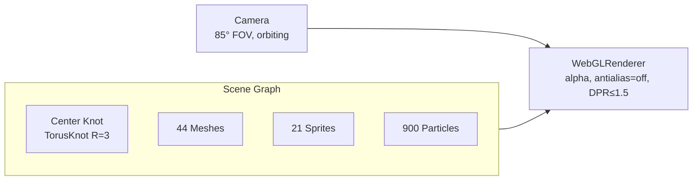

# Three.js Vortex (`ThreeChaos`)

This document describes the WebGL layer in `src/components/ThreeChaos.tsx`.

## Scene Layout

The scene is built around a central wireframe torus knot, orbited by:

- **44 meshes** picked from a zoo of seven geometries (torus knot,
  icosahedron, tetrahedron, torus, octahedron, cone, box). Each has:
  - randomised radius `r ∈ [8, 34]`
  - random spherical coordinates
  - independent rotation rates (`rx, ry, rz ∈ [-0.075, 0.075] rad/frame`)
  - orbital motion around the Y axis at rate `orbitSpeed ∈ [-0.6, 0.6]`
  - vertical bobbing at `bobSpeed ∈ [1, 4] Hz`
  - random scale `s ∈ [0.6, 2.8]`
  - 45% get `MeshNormalMaterial` (50/50 wireframe); 55% get an HSL-cycling
    `MeshBasicMaterial` (65% chance wireframe)
- **21 sprites** (3 textures × 7) billboarded at the camera, with a
  sinusoidal scale `base × (1 + 0.4·sin(5t + phase))`, orbital motion and
  rotation.
- **900-point particle field** uniformly distributed through a cube of
  half-side 35, with per-vertex HSL colours, precessing around the Y axis
  with a slight wobble.

## Camera

`PerspectiveCamera(fov=85°, near=0.1, far=200)` follows a fixed parametric
path independent of user input:

```ts
camera.position.set(sin(0.9t)·24, sin(0.55t)·12, cos(0.9t)·24);
camera.lookAt(0, 0, 0);
camera.rotation.z = sin(1.7t)·0.35;
```

The result is a slow elliptical orbit that occasionally rolls — no controls
are exposed to the user; the camera is part of the composition.

## Materials

We deliberately avoid lighting entirely. `MeshBasicMaterial` (unlit, flat
colour) and `MeshNormalMaterial` (rgb encodes surface normal) are cheap and
stay visually stable under the chaotic rotation. The HSL-cycling basic
materials continuously shift hue at phase-offset rates, producing a
rainbow strobe effect on the wireframes.



## Performance Choices

- `antialias: false` and `pixelRatio ≤ 1.5` — edges are supposed to feel
  harsh and we'd rather keep frame rates above 60 on integrated GPUs.
- No shadow maps, no lights, no postprocessing.
- Geometries are created once at module scope and shared across mounts.
- Materials and the particle geometry created per mount are disposed in
  the effect cleanup.
- `frustumCulling` (Three.js default) drops offscreen meshes — with the
  wide 85° FOV and DPR cap this is usually enough.

## Cleanup

The `useEffect` cleanup:

1. cancels the `requestAnimationFrame` loop;
2. removes the resize listener;
3. disposes the renderer;
4. disposes all mount-created materials and the particle geometry;
5. removes the canvas from the DOM.

The shared zoo `GEOMETRIES` are intentionally not disposed — they are
module-level singletons that survive HMR and navigation.
