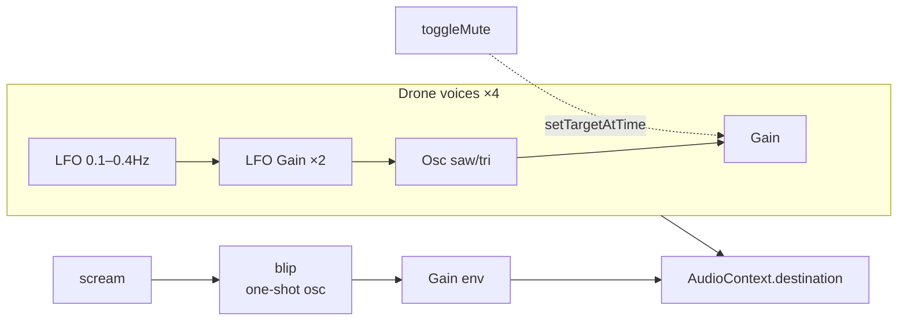

# Audio Engine

All sound in Y̷Y̶Y̸Y̵Y̷Y̶Y̸ is synthesised live via the Web Audio API — no
samples, no external files, no audio elements. The entire engine is
roughly 100 lines of TypeScript in `src/audio/engine.ts`.

## Components

### Drone

- Four oscillators at **55, 55.7, 82.4, 83.1 Hz** — the detuned pairs
  (55/55.7 and 82.4/83.1) beat against each other at roughly 0.7 Hz,
  producing a slow, throbbing quality.
- Alternating waveforms: sawtooth, triangle, sawtooth, triangle.
- Each voice has its own LFO (0.1–0.4 Hz, ±2 Hz depth) modulating pitch
  — a slow chorusing/unstable intonation.
- Nominal gain `0.018` (very quiet bed — blips are meant to cut through).
- Fade in/out via `GainNode.setTargetAtTime(..., ctx.currentTime, 0.1)`
  for smooth exponential ramps instead of clicks.

### `blip()`

One-shot glitches fired on click, popup spawn, escape-button flee, and
random visitor-counter ticks:

- random waveform: `square | sawtooth | triangle`
- exponential frequency glissando from a random start (80–1280 Hz) to a
  random end (40–2540 Hz) over 0.18 s
- gain envelope: `0.055 → 0.0001` over 0.25 s
- oscillator `.stop()` scheduled 300 ms after start — no GC pressure.

### `scream()`

A burst of 5 `blip()` calls staggered by 60 ms. Used when entering the
vortex, closing a popup (hydra rule), toggling inversion, or cranking
chaos.

## Lifecycle

AudioContext is **not** created on module import — that would fail on
browsers that suspend contexts without a user gesture. Instead:

1. The warning gate is shown with no audio.
2. Clicking **ENTER THE VOID** calls `initAudio()`, which creates the
   context and starts the drone, and immediately calls `scream()` for a
   dramatic opening.
3. If the context ends up `suspended` (e.g. from a page visibility
   change), `initAudio()` also knows how to resume an existing context.

Because the drone is 4 continuously-running oscillators connected
directly to the destination, the tab will continue to make sound while
muted is `false`. Mute fades gains to 0 but leaves oscillators running
so unmute is instantaneous.

## Muting State

`muted` is a module-local boolean. The React layer reads it via
`toggleMute()` (which returns the new state) rather than subscribing —
there is currently no need for audio state to drive rendering.
